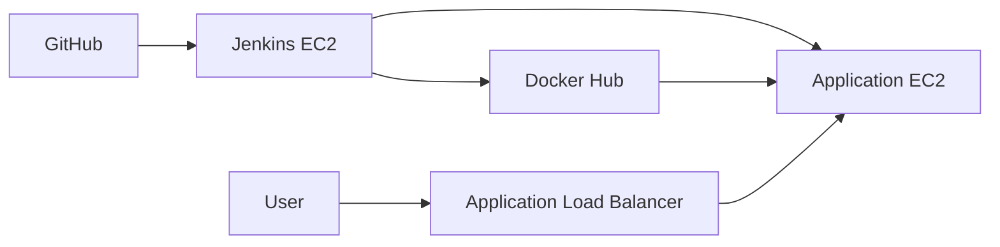
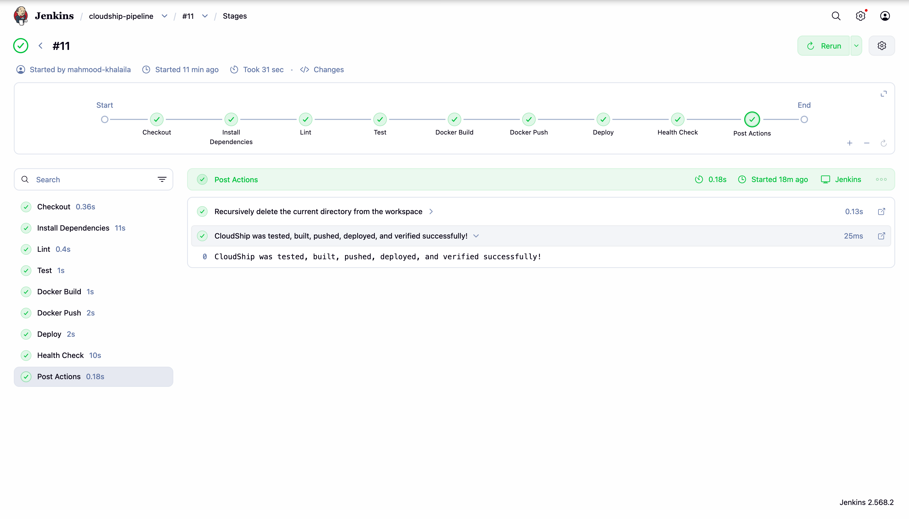
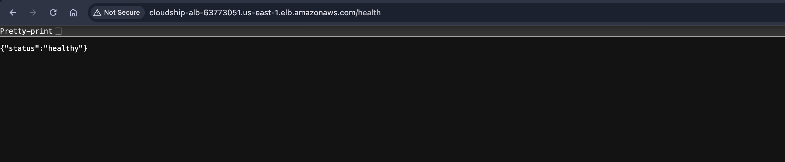
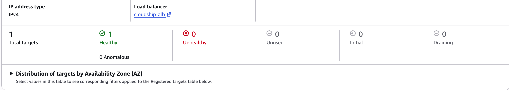
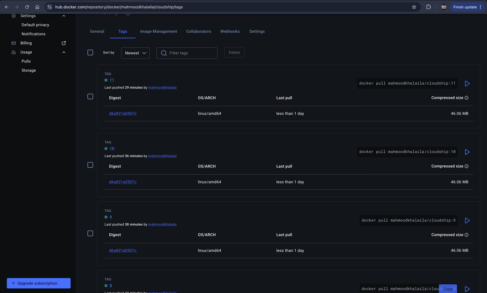

# CloudShip

CloudShip is an end-to-end DevOps project that automatically tests, containerizes, and deploys a FastAPI application to AWS.

## Architecture



Terraform provisions a VPC, two public subnets, Jenkins and application EC2 instances, security groups, and an Application Load Balancer.

## Screenshots

### Jenkins CI/CD Pipeline



### Application Health Check via ALB



### Healthy ALB Target



### Docker Hub Images



## CI/CD Pipeline

Every detected GitHub change triggers:

```text
Checkout → Flake8 → Pytest → Docker Build → Docker Push → Deploy → Health Check
```

Jenkins builds and pushes:

```text
mahmoodkhalaila/cloudship:<build-number>
mahmoodkhalaila/cloudship:latest
```

It then connects to the application EC2 instance through SSH, runs the newest image, and verifies `/health` through the load balancer.

## Application Endpoints

| Method | Endpoint | Purpose |
|---|---|---|
| `GET` | `/` | Returns `Hello, DevOps!` |
| `GET` | `/health` | Returns the application health status |
| `POST` | `/echo` | Echoes the supplied JSON |

## Technology Stack

- FastAPI, Pytest, and Flake8
- Docker and Docker Hub
- Jenkins
- Terraform
- AWS VPC, EC2, Security Groups, and ALB
- GitHub

## Run Locally

```bash
docker build -t cloudship:local .
docker run --rm -p 8000:8000 cloudship:local
curl http://localhost:8000/health
```

## Provision AWS Infrastructure

```bash
cd infra
cp terraform.tfvars.example terraform.tfvars
export AWS_PROFILE=cloudship

terraform init
terraform fmt
terraform validate
terraform plan -out=cloudship.tfplan
terraform apply cloudship.tfplan
```

Required `terraform.tfvars` values:

```hcl
admin_cidr          = "YOUR_PUBLIC_IP/32"
ssh_public_key_path = "~/.ssh/cloudship.pub"
```

## Security

- Jenkins access is restricted to the administrator IP.
- Application port `8000` accepts traffic only from the ALB.
- Application SSH accepts traffic only from Jenkins.
- Secrets are stored in Jenkins Credentials.
- The application container runs as a non-root user.
- Terraform state and sensitive variable files are excluded from Git.

## Cleanup

```bash
cd infra
terraform plan -destroy -out=destroy.tfplan
terraform apply destroy.tfplan
```

## Author

Mahmood Khalaila  
Software Engineering Student | DevOps & Cloud Enthusiast